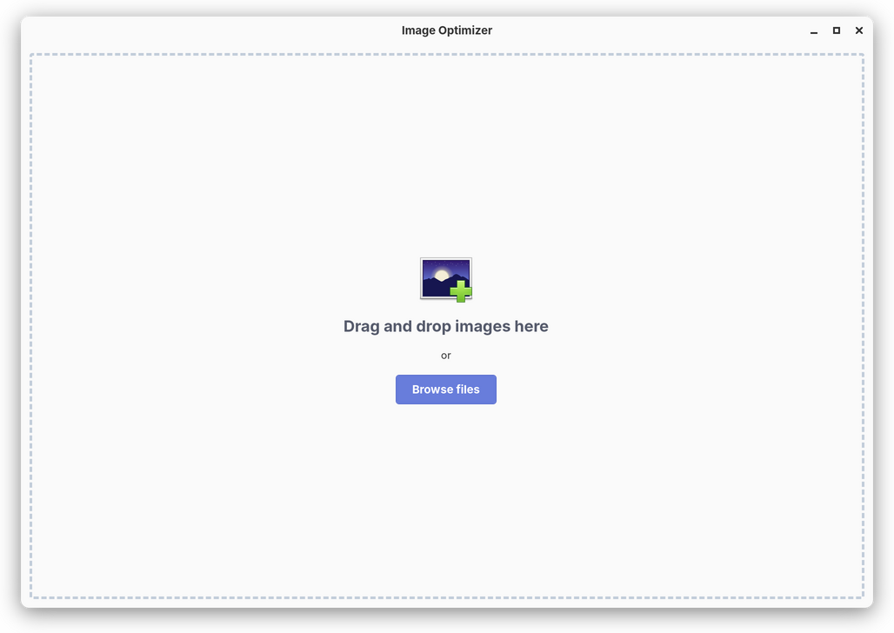

# Image Optimizer

 

Simple lossless image optimizer built with Vala and GTK.

## Supported formats

PNG and JPEG. Drop them in and they are rewritten in place, so the file you
selected is the file that gets smaller.

## What it saves

Lossless means the pixels come out identical. Nothing is re-encoded at a lower
quality, so there is no visible trade-off, and equally no dramatic saving: what
comes off is whatever the encoder left on the table.

How much that is depends entirely on the image. Some measurements:

| image | before | after | saved |
|---|---|---|---|
| screenshot, PNG | 24,441 | 19,890 | 18.6% |
| screenshot, PNG | 16,840 | 14,956 | 11.2% |
| exported JPEG | 11,261 | 11,049 | 1.9% |
| 3000x2000 photo, JPEG | 2,535,780 | 2,469,183 | 2.6% |

Screenshots and flat interface images tend to give the most, because their
encoders usually settle for the first workable compression. Photos out of a
camera or an export dialog are already close to optimal, so a few percent is a
good result there. An image that is already optimal comes back unchanged, which
is the honest answer rather than a failure.

Two details worth knowing:

- Comments, Exif, IPTC and XMP are stripped, which is part of the saving. The
  ICC colour profile is deliberately kept, because dropping it makes a
  wide-gamut image render as sRGB afterwards.
- Modification times are preserved, so optimizing a folder does not reshuffle a
  photo library sorted by date.

## Get it from the elementary OS AppCenter!
Image Optimizer is primarily available from the AppCenter of elementary OS. Download it from there!

## Get it from Flathub!
You can get Image Optimizer from Flathub no matter what distribution you're using. Download it or follow the instructions to install it from here!

## Dependencies

To build you need GTK 4.12 or newer, GLib, a C compiler, Vala, Meson, Ninja,
`msgfmt` for the translations and `update-desktop-database` for the install
step. On Ubuntu 24.04 and other Debian derivatives that is:

    sudo apt install build-essential meson ninja-build valac gettext \
                    desktop-file-utils libgtk-4-dev libglib2.0-dev

To run, the app needs the two optimizers it drives. They are not needed to
build, but without them nothing gets compressed:

    sudo apt install jpegoptim optipng

Two more are optional. Install them before configuring, because Meson looks
them up once at that point:

    sudo apt install appstream xvfb xdotool

`appstream` adds the MetaInfo validation to `ninja test`, which otherwise runs
one test instead of two. `xvfb` and `xdotool` are for the scripts under
[Tests](#tests).

## Building

Simply clone this repo, then:

Run `meson setup build` to configure the build environment and `ninja -C build test` to build and run the automated tests

    meson setup build --prefix=/usr
    ninja -C build test

To install, use `ninja install`, then execute with `com.github.gijsgoudzwaard.image-optimizer`

    sudo ninja -C build install
    com.github.gijsgoudzwaard.image-optimizer

## Tests

`ninja test` covers the desktop and MetaInfo files. Two more scripts run the
real binary, because a build that compiles is not the same as an app that
works: the GTK4 port of the image list once did the former without the latter.

Install into a staging tree first, then point them at the binary:

    meson setup build --prefix=/usr
    ninja -C build
    DESTDIR="$PWD/dest" ninja -C build install

    .github/scripts/smoke-test.sh dest/usr/bin/com.github.gijsgoudzwaard.image-optimizer
    .github/scripts/regression-test.sh dest/usr/bin/com.github.gijsgoudzwaard.image-optimizer

`smoke-test.sh` starts the app on a virtual display, hands it a PNG and a JPEG,
and requires them to come back smaller with nothing logged.

`regression-test.sh` covers what has actually broken before: awkward filenames,
unreadable files, whole batches being skipped, parallel output matching
sequential, a single core machine, and Ctrl+Q. Both need `xvfb`, and the
regression suite also needs `xdotool`.

Both run in CI on amd64 and arm64, so a pull request gets the same answer you
do locally.

## License

Released under the [MIT License](LICENSE).

## Support this project

Image Optimizer is free and open source. If you find it useful, you can support
its development with a one-off or recurring donation:

Contributions are just as welcome — bug reports, translations and pull requests
all help. See the [issue tracker](https://github.com/GijsGoudzwaard/Image-Optimizer/issues)
to get started.
