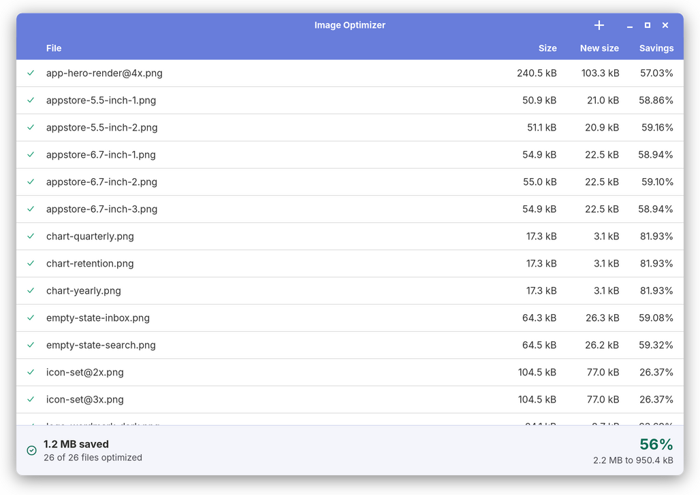
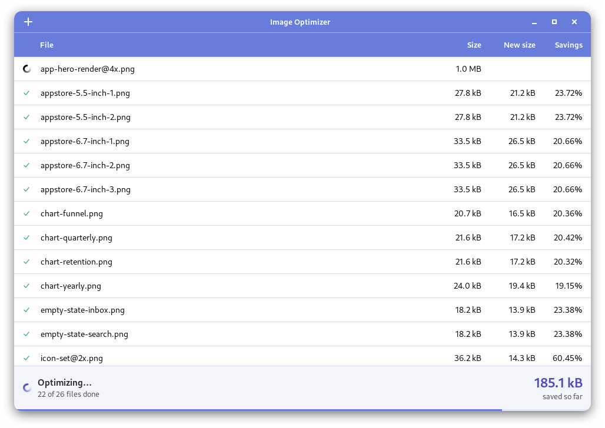

# Image Optimizer

[](https://flathub.org/apps/com.github.gijsgoudzwaard.image-optimizer)
[](https://flathub.org/apps/com.github.gijsgoudzwaard.image-optimizer)
[](https://github.com/GijsGoudzwaard/Image-Optimizer/actions/workflows/pipelines.yml)
[](https://ko-fi.com/imageoptimizer)

**Make PNG and JPEG files smaller without touching how they look.** Drop a folder
in, and every file is rewritten in place with identical pixels and a smaller size.



## Install

<a href="https://flathub.org/apps/com.github.gijsgoudzwaard.image-optimizer"></a>
&nbsp;
<a href="https://snapcraft.io/image-optimizer"></a>

```sh
flatpak install flathub com.github.gijsgoudzwaard.image-optimizer   # any distribution
sudo snap install image-optimizer                                   # Ubuntu and anywhere snaps run
```

Both stores publish for amd64 and arm64, and both bundle the optimizer, so there is nothing else to install.

## What it saves

Lossless means the pixels come out identical. Nothing is re-encoded at a lower
quality, so there is no visible trade-off, and equally no magic: what comes off
is whatever the encoder left on the table.

How much that is depends entirely on the file.

| file | before | after | saved |
|---|---|---|---|
| flat artwork as a 24-bit PNG, 1200x900 with 105 colours | 11,156 | 4,214 | **62.2%** |
| interface screenshot, 24-bit PNG, 980x680 | 16,286 | 11,778 | 27.7% |
| window screenshot, 24-bit PNG, 1100x800 | 49,305 | 35,692 | 27.6% |
| JPEG straight from an export dialog | 11,261 | 10,044 | 10.8% |
| photo with Exif, 41 kB JPEG | 41,496 | 39,099 | 5.8% |

Every one of those was compared against its input pixel by pixel afterwards, and
came back identical.

The pattern is worth knowing before you try it. Anything flat, exported as a
24-bit PNG by a design tool, gives the most, because those files carry a full
colour channel they never use. Screenshots give a quarter or so. Photos are
already close to optimal, so a few percent is a good result there and not a
disappointment.

The screenshot above is a folder of 26 exported assets of that first kind, which
came to 2.2 MB and left as 950 kB. An image that is already optimal comes back
untouched, and the app says so rather than pretending it did something.

## Why this one

- **It rewrites the file you picked.** No copy next to it, no `-optimized`
  suffix, and the modification time is kept, so optimizing a folder does not
  reshuffle a photo library sorted by date.
- **It keeps what an image needs to look right.** The ICC colour profile stays,
  because dropping it makes a wide-gamut image render as sRGB afterwards, and so
  does Exif, because that is where the orientation flag lives and a phone stores
  a portrait photo as a landscape image plus that flag. A PNG that says nothing
  at all about its colours is stripped, because there the saving is free, and a
  JPEG keeps everything it came with. That costs very little: measured on a photo
  with Exif, 240 bytes out of 39 kB.
- **It never sends your images anywhere.** No account, no upload, no network
  access at all. On Flathub the app holds three permissions in total, and not one
  of them is filesystem access: files reach it through the desktop portals, so it
  can open the file you pointed at and nothing around it. You can check that
  yourself under Permissions on [its Flathub page](https://flathub.org/apps/com.github.gijsgoudzwaard.image-optimizer).
- **It does the whole batch at once**, several files in parallel, one worker per
  core.
- **It tells you what happened to each file**: how much came off, or that there
  was nothing left to remove, or why it could not be written.



## Supported formats

PNG and JPEG. Anything else keeps a row in the list saying it is not supported,
rather than disappearing without a word.

## Contributing

Bug reports, translations and pull requests are all welcome. The
[issue tracker](https://github.com/GijsGoudzwaard/Image-Optimizer/issues) is the
place to start.

### Building

You need GTK 4.12 or newer, GLib, a C compiler, Vala, Meson, Ninja, `msgfmt` and
`update-desktop-database`. On Ubuntu 24.04 and other Debian derivatives:

```sh
sudo apt install build-essential meson ninja-build valac gettext \
                 desktop-file-utils libgtk-4-dev libglib2.0-dev libxml2-utils
sudo apt install appstream xvfb xdotool     # optional, see below
```

The app shells out to [Efficient Compression Tool][ect] to do the actual
optimizing, so you need that on your `PATH` to run it. It is not packaged for
Debian or Ubuntu, and its libpng and mozjpeg are git submodules, so it is built
from source:

```sh
sudo apt install cmake nasm
git clone --recursive https://github.com/fhanau/Efficient-Compression-Tool
cd Efficient-Compression-Tool
cmake -S src -B build -DCMAKE_BUILD_TYPE=Release
cmake --build build -j"$(nproc)"
sudo cmake --install build
```

[ect]: https://github.com/fhanau/Efficient-Compression-Tool

Install the optional three before configuring, because Meson looks them up once
at that point. `appstream` adds the MetaInfo validation to `ninja test`, which
otherwise runs one test instead of two. `xvfb` and `xdotool` are for the scripts
below.

```sh
meson setup build --prefix=/usr
ninja -C build test
sudo ninja -C build install
com.github.gijsgoudzwaard.image-optimizer
```

### Tests

`ninja test` covers the desktop and MetaInfo files. Two more scripts run the real
binary, because a build that compiles is not the same as an app that works: the
GTK4 port of the image list once did the former without the latter.

```sh
DESTDIR="$PWD/dest" ninja -C build install
.github/scripts/smoke-test.sh dest/usr/bin/com.github.gijsgoudzwaard.image-optimizer
.github/scripts/regression-test.sh dest/usr/bin/com.github.gijsgoudzwaard.image-optimizer
```

`smoke-test.sh` starts the app on a virtual display, hands it a PNG and a JPEG,
and requires them to come back smaller with nothing logged. `regression-test.sh`
covers what has actually broken before: awkward filenames, unreadable files,
whole batches being skipped, parallel output matching sequential, a single core
machine, read-only files and directories, a second pass over an already optimal
file, colour profiles and Exif surviving, modification times surviving, an
optimizer that is not installed, and Ctrl+Q. A few of its checks point the app at
a stand-in optimizer instead of the real one, because what they are about is what
the app does with the answers it gets, and that should not depend on how the real
one happens to behave that day. Both run in CI on amd64 and arm64, so a pull
request gets the same answer you do locally.

## Support this project

Image Optimizer is free and open source. If you find it useful, you can support
its development with a one-off or recurring donation.

[](https://ko-fi.com/imageoptimizer)

Released under the [MIT License](LICENSE).
