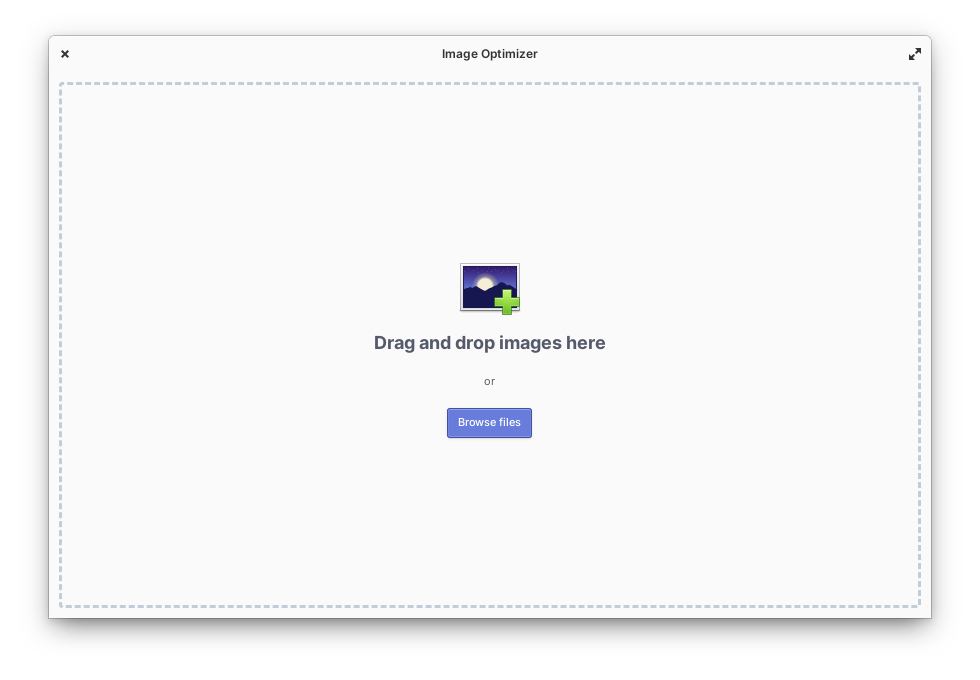

# Image Optimizer
[](https://appcenter.elementary.io/com.github.gijsgoudzwaard.image-optimizer)

Simple lossless image optimizer built for [elementary OS](https://elementary.io).



## Donations
Do you like the app? Would you like to support its development? Feel free to donate

[](https://paypal.me/gijsgoudzwaard)

## Dependencies

Please make sure you have these dependencies first before building.

```
granite
gtk+-3.0
glib-2.0
jpegoptim
optipng
```

## Building

Simply clone this repo, then:

Run `meson build` to configure the build environment and run `ninja test` to build and run automated tests

    meson build --prefix=/usr
    cd build
    ninja test

To install, use `ninja install`, then execute with `com.github.gijsgoudzwaard.image-optimizer`

    sudo ninja install
    com.github.gijsgoudzwaard.image-optimizer
